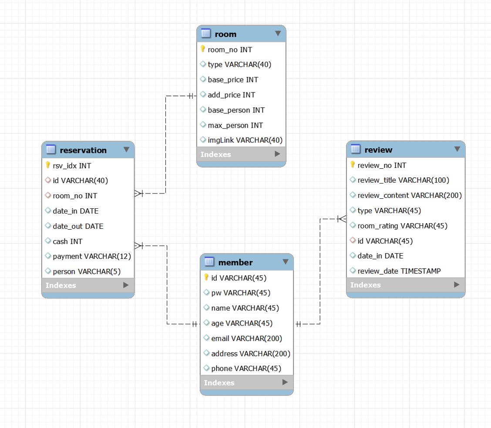

<h2>🍀 the_shilla 🍀</h2>
호텔예약사이트

<h3>👉 Description</h3>
<!-- 
 -->
호텔예약사이트 팀(2인) 프로젝트입니다. Spring Framework를 이용한 MVC 패턴 구현, MyBatis를 통한 데이터 베이스 프로그래밍 효율적인 개발 방법을 복습하고 응용하여 웹개발 능력을 키우는 것을 목표로 했습니다.

<h3>👟 How to use</h3>
<!-- 
 -->
    <ul>
      <li>로그인 후 사용을 해야합니다. 비회원일 경우 예약이 <del>불가능</del> 합니다</li>
      <li>날짜를 선택 후, 원하는 룸을 선택합니다.</li>
      <li>예약을 합니다.</li>
      <li>예약 후 예약조회에서 결제/취소를 클릭합니다.</li>
  

      <li>결제 후에는 리뷰를 작성할 수 있습니다.</li>
      <li>리뷰페이지에서 작성된 리뷰를 확인할 수 있습니다.</li>
      <li>객실에 대한 상세정보가 궁금하시다면 호텔소개를 클릭합니다.</li>
    </ul>

<h3>🌿 Database</h3>
<!-- 
 -->

<h3>🏆 Preview</h3>
<!-- 
 -->

<h4>로그인&r객실상세</h4>

<h4>객실조회&예약확인</h4>

<h4>결제&취소</h4>

<h4>이용후기</h4>

<h3>🌱 Contributors</h3>
<!-- 
 -->

  &nbsp;&nbsp;&nbsp;&nbsp;&nbsp;&nbsp;남정희 
  <a href="https://github.com/junghee11">Github</a>
   
  &nbsp;&nbsp;&nbsp;&nbsp;&nbsp;&nbsp;육희영 
  <a href="https://github.com/helloyoogs">Github</a>

  <h4>Frontend</h4>
    <ul>
      <li>육희영 : 로그인, 회원가입, 메인, 예약페이지</li>
      <li>남정희 : 리뷰게시판, 객실소개페이지</li>
    </ul>
  <h4>Backend</h4>
    <ul>
      <li>육희영 : 회원가입, 로그인, 리뷰게시판</li>
      <li>남정희 : 날짜별 객실조회, 예약&조회, 결제</li>
    </ul>

<h3>🧤 Development enviroment</h3>
<!-- 
 -->
  <ul>
      <li>Spring framework</li>
      <li>JAVA 1.8</li>
      <li>MyBatis</li>
      <li>ajax</li>
      <li>javascript</li>
      <li>MySQL, MariaDB</li>
      <li>Web Server Tomcat 8.5</li>
      <li>JSTL</li>
      <li>jQuery</li>
  </ul>
